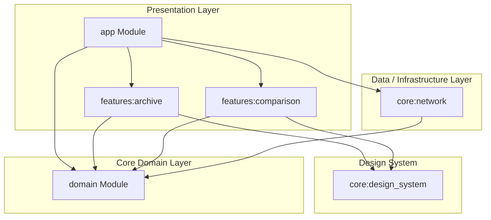

# SuperHero Archive — Project & Architecture Guide

Welcome to the **SuperHero Archive** project! This guide provides a detailed overview of the application's architecture, directory layout, build system, and testing infrastructure. It is designed to help both human developers and agentic AI systems quickly onboard and make clean, idiomatically correct contributions.

---

## 1. Architectural Blueprint: Clean Architecture

The codebase adheres strictly to **Clean Architecture** principles, enforcing a unidirectional dependency flow: **Presentation & Data layers depend inward on the Domain layer**, while the Domain layer remains independent of any frameworks, libraries (like Retrofit or Android SDK), and databases.

### Dependency Rules:
1. **Domain (`:domain`)** has no external framework dependencies. It defines pure-Kotlin business entities, use cases, and repository interfaces.
2. **Data (`:core:network`)** implements repository interfaces defined in the Domain. It manages API interactions, JSON serialization, sanitization, and caching.
3. **Presentation (`:features:*` and `:app`)** interacts with the Domain via Use Cases. ViewModels expose state via Kotlin Flows and represent the screen logic. Compose components render the UI using the shared `:core:design_system`.
4. **App (`:app`)** serves as the system configurator, orchestrating navigation and Dagger Hilt dependency injection.

---

## 2. Multi-Module Project Structure

The project is divided into specialized Gradle modules. Here is a breakdown of their responsibilities:

### 📂 `:domain` (Domain Layer)
*   **Purpose**: Contains core business rules, entity models, and use cases.
*   **Key Packages**:
    *   [`model/`](file:///c:/Users/Ana/Projects/Antigravity/SuperHero%20Archive/domain/src/main/kotlin/com/anenha/superhero/domain/model): Pure data classes representing domain objects (`SuperHero`, `Biography`, `Appearance`, `PowerStats`, `Work`, `Connections`).
    *   [`repository/`](file:///c:/Users/Ana/Projects/Antigravity/SuperHero%20Archive/domain/src/main/kotlin/com/anenha/superhero/domain/repository): Interface [`SuperHeroRepository`](file:///c:/Users/Ana/Projects/Antigravity/SuperHero%20Archive/domain/src/main/kotlin/com/anenha/superhero/domain/repository/SuperHeroRepository.kt) defining network calls abstractly.
    *   [`usecase/`](file:///c:/Users/Ana/Projects/Antigravity/SuperHero%20Archive/domain/src/main/kotlin/com/anenha/superhero/domain/usecase): Reusable business rules.
        *   [`GetRandomInitialHeroesUseCase`](file:///c:/Users/Ana/Projects/Antigravity/SuperHero%20Archive/domain/src/main/kotlin/com/anenha/superhero/domain/usecase/GetRandomInitialHeroesUseCase.kt): Fetches a random set of starting superheroes.
        *   [`SearchHeroesUseCase`](file:///c:/Users/Ana/Projects/Antigravity/SuperHero%20Archive/domain/src/main/kotlin/com/anenha/superhero/domain/usecase/SearchHeroesUseCase.kt): Triggers searches by hero name.
        *   [`GetHeroDetailsUseCase`](file:///c:/Users/Ana/Projects/Antigravity/SuperHero%20Archive/domain/src/main/kotlin/com/anenha/superhero/domain/usecase/GetHeroDetailsUseCase.kt): Retrieves detailed statistics for a selected hero ID.
    *   [`di/`](file:///c:/Users/Ana/Projects/Antigravity/SuperHero%20Archive/domain/src/main/kotlin/com/anenha/superhero/domain/di): Exposes Hilt providers for the use cases.

### 📂 `:core:network` (Data Layer)
*   **Purpose**: Manages remote data storage and network infrastructure.
*   **Key Packages & Components**:
    *   [`service/`](file:///c:/Users/Ana/Projects/Antigravity/SuperHero%20Archive/core/network/src/main/kotlin/com/anenha/superhero/core/network/service): Retrofit interface [`SuperHeroService`](file:///c:/Users/Ana/Projects/Antigravity/SuperHero%20Archive/core/network/src/main/kotlin/com/anenha/superhero/core/network/service/SuperHeroService.kt).
    *   [`repository/`](file:///c:/Users/Ana/Projects/Antigravity/SuperHero%20Archive/core/network/src/main/kotlin/com/anenha/superhero/core/network/repository): Concrete repository implementation [`SuperHeroRepositoryImpl`](file:///c:/Users/Ana/Projects/Antigravity/SuperHero%20Archive/core/network/src/main/kotlin/com/anenha/superhero/core/network/repository/SuperHeroRepositoryImpl.kt).
    *   [`interceptor/`](file:///c:/Users/Ana/Projects/Antigravity/SuperHero%20Archive/core/network/src/main/kotlin/com/anenha/superhero/core/network/interceptor):
        *   [`SanitizeJsonInterceptor`](file:///c:/Users/Ana/Projects/Antigravity/SuperHero%20Archive/core/network/src/main/kotlin/com/anenha/superhero/core/network/interceptor/SanitizeJsonInterceptor.kt): Resolves malformed or double-escaped JSON from the remote Superhero API (e.g., converting `\/` to `/` and resolving double-escaped quotes).
        *   [`CacheInterceptor`](file:///c:/Users/Ana/Projects/Antigravity/SuperHero%20Archive/core/network/src/main/kotlin/com/anenha/superhero/core/network/interceptor/CacheInterceptor.kt): Forces caching of network responses locally for **7 days** to ensure robust offline support and reduce unnecessary network traffic.
    *   [`di/`](file:///c:/Users/Ana/Projects/Antigravity/SuperHero%20Archive/core/network/src/main/kotlin/com/anenha/superhero/core/network/di): Binds `SuperHeroRepository` and provisions Retrofit, OkHttpClient (configured with a 50MB cache directory), and kotlinx.serialization.

### 📂 `:core:design_system` (UI Utilities & Components)
*   **Purpose**: Shared UI design components and branding assets.
*   **Key Packages & Components**:
    *   [`theme/`](file:///c:/Users/Ana/Projects/Antigravity/SuperHero%20Archive/core/design_system/src/main/kotlin/com/anenha/superhero/core/designsystem/theme): Theme setup ([`VanguardKineticTheme`](file:///c:/Users/Ana/Projects/Antigravity/SuperHero%20Archive/core/design_system/src/main/kotlin/com/anenha/superhero/core/designsystem/theme/Theme.kt)), shapes, colors (harmony dark theme palettes), and typography styling.
    *   [`component/`](file:///c:/Users/Ana/Projects/Antigravity/SuperHero%20Archive/core/design_system/src/main/kotlin/com/anenha/superhero/core/designsystem/component): Reusable Compose items:
        *   `VanguardTopBar` & `VanguardSearchBar`: Design-harmonious components.
        *   `SegmentedPowerBar`: Displays individual capability stats in segmented visual blocks.
        *   `BidirectionalPowerBar`: Used in comparisons to map two heroes' metrics side-by-side relative to each other.
        *   `HexagonImageFrame`: Trims hero avatars into stylized hexagonal frames.

### 📂 `:features:archive` (Presentation Layer)
*   **Purpose**: Handles search, lists of heroes, and detailed hero sheets.
*   **Key Packages & Components**:
    *   [`screen/archive/`](file:///c:/Users/Ana/Projects/Antigravity/SuperHero%20Archive/features/archive/src/main/kotlin/com/anenha/superhero/features/archive/screen/archive): [`ArchiveScreen`](file:///c:/Users/Ana/Projects/Antigravity/SuperHero%20Archive/features/archive/src/main/kotlin/com/anenha/superhero/features/archive/screen/archive/ArchiveScreen.kt) & [`ArchiveViewModel`](file:///c:/Users/Ana/Projects/Antigravity/SuperHero%20Archive/features/archive/src/main/kotlin/com/anenha/superhero/features/archive/screen/archive/ArchiveViewModel.kt). Searches are debounced by 300ms, triggering only when queries are 3+ characters long.
    *   [`screen/details/`](file:///c:/Users/Ana/Projects/Antigravity/SuperHero%20Archive/features/archive/src/main/kotlin/com/anenha/superhero/features/archive/screen/details): [`DetailsScreen`](file:///c:/Users/Ana/Projects/Antigravity/SuperHero%20Archive/features/archive/src/main/kotlin/com/anenha/superhero/features/archive/screen/details/DetailsScreen.kt) & [`DetailsViewModel`](file:///c:/Users/Ana/Projects/Antigravity/SuperHero%20Archive/features/archive/src/main/kotlin/com/anenha/superhero/features/archive/screen/details/DetailsViewModel.kt). Displays complex biography, stats, and relations.
    *   [`component/`](file:///c:/Users/Ana/Projects/Antigravity/SuperHero%20Archive/features/archive/src/main/kotlin/com/anenha/superhero/features/archive/component): Screen sub-components (`HeroBanner`, `PowerStatsSection`, `WorkSection`, `RelativesSection`, `HeroCard`).

### 📂 `:features:comparison` (Presentation Layer)
*   **Purpose**: Manages side-by-side comparisons of two heroes.
*   **Key Packages & Components**:
    *   [`screen/comparison/`](file:///c:/Users/Ana/Projects/Antigravity/SuperHero%20Archive/features/comparison/src/main/kotlin/com/anenha/superhero/features/comparison/screen/comparison): [`ComparisonScreen`](file:///c:/Users/Ana/Projects/Antigravity/SuperHero%20Archive/features/comparison/src/main/kotlin/com/anenha/superhero/features/comparison/screen/comparison/ComparisonScreen.kt) & [`ComparisonViewModel`](file:///c:/Users/Ana/Projects/Antigravity/SuperHero%20Archive/features/comparison/src/main/kotlin/com/anenha/superhero/features/comparison/screen/comparison/ComparisonViewModel.kt). Handles fetching and comparing stats for two unique hero entities.
    *   [`component/`](file:///c:/Users/Ana/Projects/Antigravity/SuperHero%20Archive/features/comparison/component): Custom layouts (`HeadToHeadSection`, `HexagonPortrait`).

### 📂 `:app` (Orchestrator Module)
*   **Purpose**: Connects features, setups Hilt injection entry points, and handles main routing.
*   **Key Packages & Components**:
    *   [`SuperHeroApplication`](file:///c:/Users/Ana/Projects/Antigravity/SuperHero%20Archive/app/src/main/kotlin/com/anenha/superhero/app/SuperHeroApplication.kt): The standard Hilt-enabled `@HiltAndroidApp` implementation.
    *   [`ScreenRoute`](file:///c:/Users/Ana/Projects/Antigravity/SuperHero%20Archive/app/src/main/kotlin/com/anenha/superhero/app/ScreenRoute.kt): Defines the serializable routes (`ArchiveRoute`, `DetailsRoute`, `ComparisonRoute`) implementing Navigation 3's `NavKey`.
    *   [`MainActivity`](file:///c:/Users/Ana/Projects/Antigravity/SuperHero%20Archive/app/src/main/kotlin/com/anenha/superhero/app/MainActivity.kt): Integrates Hilt entry points, sets up full edge-to-edge transparent system bars, and declares [`AppNavigation`](file:///c:/Users/Ana/Projects/Antigravity/SuperHero%20Archive/app/src/main/kotlin/com/anenha/superhero/app/MainActivity.kt#L89) which uses `SharedTransitionLayout` to provide smooth, high-fidelity shared element animations.

---

## 3. Build Logic & Shared Gradle Configuration

The project utilizes Gradle's modern features for build configuration:
1.  **Composite Build (`build-logic`)**: Rather than duplicating compilation setups across multi-module build scripts, custom precompiled script plugins are defined in `build-logic`:
    *   [`android.application.gradle.kts`](file:///c:/Users/Ana/Projects/Antigravity/SuperHero%20Archive/build-logic/src/main/kotlin/android.application.gradle.kts): Defines application SDK configs (`compileSdk = 37`, `minSdk = 28`, `targetSdk = 37`, Java 21).
    *   [`android.library.gradle.kts`](file:///c:/Users/Ana/Projects/Antigravity/SuperHero%20Archive/build-logic/src/main/kotlin/android.library.gradle.kts): Configures shared library defaults.
    *   [`android.compose.gradle.kts`](file:///c:/Users/Ana/Projects/Antigravity/SuperHero%20Archive/build-logic/src/main/kotlin/android.compose.gradle.kts): Configures Compose compiler and injects Compose BOM & material dependencies directly.
2.  **Version Catalog**: Dependencies and versions are centralized inside [`gradle/libs.versions.toml`](file:///c:/Users/Ana/Projects/Antigravity/SuperHero%20Archive/gradle/libs.versions.toml).
3.  **API Keys Management**: The Superhero API token is managed securely using the secrets Gradle plugin. The network base URL pulls the API access token via `BuildConfig.SUPERHERO_ACCESS_TOKEN`.

---

## 4. Testing Architecture

Testing is split into unit and presentation verification. To eliminate duplicate mocking and mock boilerplate across the codebase, a **Gradle Test Fixture** setup is employed:
*   **Test Fixtures**: The `:domain` module declares `testFixtures` containing helper functions and fake repositories:
    *   [`FakeSuperHeroRepository`](file:///c:/Users/Ana/Projects/Antigravity/SuperHero%20Archive/domain/src/testFixtures/kotlin/com/anenha/superhero/domain/repository/FakeSuperHeroRepository.kt): An in-memory, thread-safe test double representing `SuperHeroRepository` that can simulate failures or pre-fill hero statistics.
    *   `createFakeHero()`: Standardized mock hero builder function.
*   **MainDispatcherRule**: A coroutine testing rule ([`MainDispatcherRule.kt`](file:///c:/Users/Ana/Projects/Antigravity/SuperHero%20Archive/domain/src/testFixtures/kotlin/com/anenha/superhero/domain/util/MainDispatcherRule.kt)) is provided under the test fixture structure to automatically bind and clean up a StandardTestDispatcher to the `Dispatchers.Main` dispatcher thread during local JVM tests.

---

## 5. Technology Stack Summary

| Technology | Purpose                                                                  |
| :--- |:-------------------------------------------------------------------------|
| **Language** | Kotlin (1.9.24+ / Java 21)                                               |
| **UI Framework** | Jetpack Compose (Material 3)                                             |
| **Asynchronous Engine** | Kotlin Coroutines & StateFlow / SharedFlow                               |
| **Networking** | Retrofit 2 + OkHttp (including offline caching and payload sanitization) |
| **Serialization** | Kotlinx Serialization JSON                                               |
| **Image Loader** | Coil Compose                                                             |
| **DI** | Dagger Hilt                                                              |
| **Navigation** | AndroidX Navigation 3 + Shared Element Transitions                       |
| **Unit Testing** | JUnit 4 + Coroutines Test                                                |
