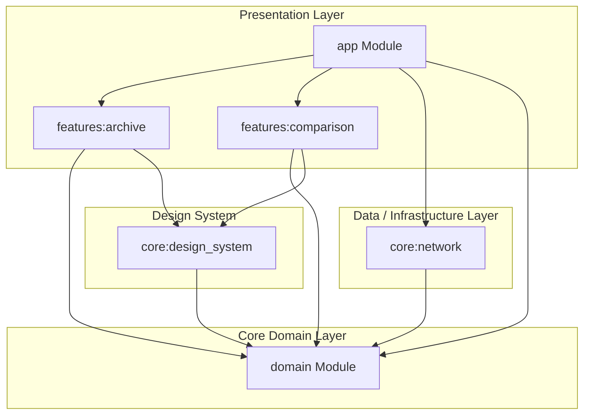

[](https://img.shields.io/badge/Architecture-Clean%20Architecture-blue?style=for-the-badge)
[](https://img.shields.io/badge/UI-Jetpack%20Compose-3DDC84?style=for-the-badge&logo=android&logoColor=white)
[](https://img.shields.io/badge/Networking-Retrofit-red?style=for-the-badge)
[](https://img.shields.io/badge/DI-Hilt-orange?style=for-the-badge)
[](https://img.shields.io/badge/Language-Kotlin-purple?style=for-the-badge&logo=kotlin)

# SuperHero Archive<br clear="left" />

A modern Android application that catalogs, details, and compares superheroes from the Superhero API. Built using modern Android development practices, **Clean Architecture**, and Jetpack Compose.

## 📱 App Demo

[super-hero-app.webm](https://github.com/user-attachments/assets/7783732a-df08-4624-a9d4-2d99f73280ea)

---

## 🚀 Key Features

*   **Hero Archive Search**: Search heroes with a debounced (300ms) query, requiring at least 3 characters. Includes random hero recommendations for initial onboarding.
*   **Hero Details Screen**: Displays comprehensive metadata for a superhero including full power stats, detailed biography, work locations, and relatives.
*   **Head-to-Head Comparison**: Compare the stats of two different superheroes side-by-side using bidirectional comparison bars.
*   **Offline Support & Caching**: All REST requests are cached locally for **7 days** using OkHttp network cache (50MB storage), providing excellent offline resilience.
*   **Shared Element Transitions**: Uses Compose Navigation 3 and `SharedTransitionLayout` to animate hero banners smoothly from the archive grid to the detailed page.
*   **Vanguard Kinetic Design System**: Harmonious dark mode design utilizing custom typographic styles, custom segmented progress bars, and hexagonal cropping frameworks.

---

## 🏛️ Architecture Pattern

The project implements **Clean Architecture** with a unidirectional dependency flow. Presentation and Data modules depend inward on the pure-Kotlin Domain module.



### Dependency Rules
*   **Domain Layer** has zero framework dependencies. It represents the core business models, repositories, and use cases.
*   **Data Layer** deals with network interfaces, OkHttp caching, and custom interceptors to sanitize API JSON formatting anomalies.
*   **Presentation Layer** uses Jetpack Compose with unidirectional data flow (MVI/MVVM). ViewModels handle state changes and talk exclusively to Domain use cases.

---

## 📂 Gradle Multi-Module Layout

The app is modularized into specialized modules to guarantee separation of concerns:

| Module | Type | Description |
| :--- | :--- | :--- |
| [`:domain`](file:///c:/Users/Ana/Projects/Antigravity/SuperHero%20Archive/domain) | Pure Kotlin | Domain models (`SuperHero`, `PowerStats`, etc.), use cases, and repository interfaces. |
| [`:core:network`](file:///c:/Users/Ana/Projects/Antigravity/SuperHero%20Archive/core/network) | Android Library | API definitions, JSON serialization, `SanitizeJsonInterceptor` (resolves escaped slash/quote issues), and cache enforcement. |
| [`:core:design_system`](file:///c:/Users/Ana/Projects/Antigravity/SuperHero%20Archive/core/design_system) | Android Library | Styling, theme (`VanguardKineticTheme`), colors, typography, shapes, and custom UI views (segmented capability bars). |
| [`:features:archive`](file:///c:/Users/Ana/Projects/Antigravity/SuperHero%20Archive/features/archive) | Android Library | Search view models, grid layouts, detailed information pages, and banner transitions. |
| [`:features:comparison`](file:///c:/Users/Ana/Projects/Antigravity/SuperHero%20Archive/features/comparison) | Android Library | UI layouts and business logic for comparing two heroes. |
| [`:app`](file:///c:/Users/Ana/Projects/Antigravity/SuperHero%20Archive/app) | Android Application | Main coordinator, Hilt integration, and route definitions (`ScreenRoute`). |

---

## 🛠️ Build Logic

*   **Composite Build (`build-logic`)**: Shared Kotlin DSL compilation configurations are defined under [`build-logic`](file:///c:/Users/Ana/Projects/Antigravity/SuperHero%20Archive/build-logic) via precompiled script plugins:
    *   `android.application.gradle.kts` (SDK versions compileSdk = 37, minSdk = 28, targetSdk = 37)
    *   `android.library.gradle.kts`
    *   `android.compose.gradle.kts`
*   **Version Catalog**: Dependencies are centralized inside [`gradle/libs.versions.toml`](file:///c:/Users/Ana/Projects/Antigravity/SuperHero%20Archive/gradle/libs.versions.toml) for modular updates.

---

## 🧪 Testing Architecture

Tests are split between local JVM tests and repository fakes:
*   **Gradle Test Fixtures**: The `:domain` module uses the `testFixtures` plugin to share [`FakeSuperHeroRepository`](file:///c:/Users/Ana/Projects/Antigravity/SuperHero%20Archive/domain/src/testFixtures/kotlin/com/anenha/superhero/domain/repository/FakeSuperHeroRepository.kt) across downstream test compilation environments.
*   **Coroutine Dispatchers**: Unit tests run using JUnit 4 and a custom [`MainDispatcherRule`](file:///c:/Users/Ana/Projects/Antigravity/SuperHero%20Archive/domain/src/testFixtures/kotlin/com/anenha/superhero/domain/util/MainDispatcherRule.kt) to manage standard coroutines dispatchers under test threads.

---

## 🏁 Getting Started

### Prerequisites
*   Android Studio Ladybug or newer.
*   JDK 21 configured.

### Setting up the API Token
1. Register and get a token on [Superhero API](https://superheroapi.com).
2. Add your token to the [`local.properties`](file:///c:/Users/Ana/Projects/Antigravity/SuperHero%20Archive/local.properties) file:
    ```properties
    SUPERHERO_ACCESS_TOKEN=your_token_here
    ```

### Running from Command Line
Run the debug application assemble command:
```bash
./gradlew assembleDebug
```
